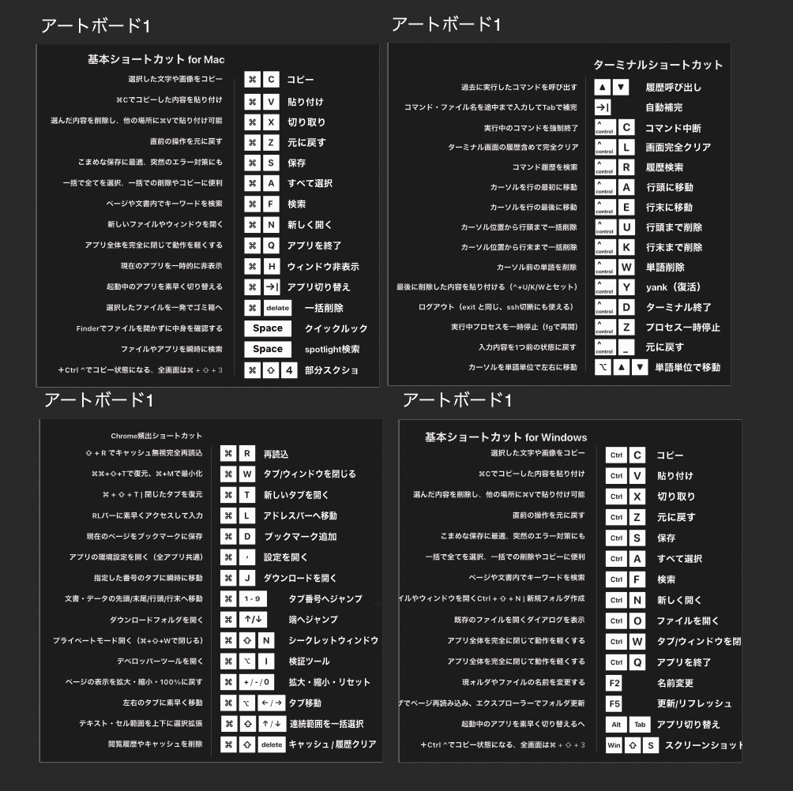

# 📊 進捗管理

**リポジトリ作成日: 2025/11/10**  
**最終更新日: 2026/1/3**

---

## 🎯 現在の状況

### 印刷業者
- **ステッカージャパン** に決定 ✅
- **仕様**: 屋外用エンビクロス角丸
- **サイズ**: 80mm×80mmの正方形
- **初回印刷**: 10枚×2パターン = 20枚、2160円×2 = 4320円

### テスト販売・ユーザーテスト
- **2025/12/6**: ユーザーテストとして2人に共有 ✅
- **2025/12/30**: 初回テスト販売 ✅

### 販売実績
- **2026/1/1**: メルカリで1件売れた ✅
- **BASE店舗**: 作成完了 ✅

### データ入稿状況
- **2025/12/3**: 初版データ入稿完了
  - Mac初心者編
  - ターミナル編
- **2026/1/3**: 追加入稿完了
  - Chrome中級編
  - Windows編

---

## 📋 次のステップ

### 短期目標（1月中）
- [ ] サムネイル作成
- [ ] メルカリ・BASE 2店舗での販売開始
- [ ] 商品ページの最適化
- [x] 商品紹介文・商品説明案の作成（[詳細](./sales/product-descriptions.md)）

### 中期目標（3ヶ月後）
- [ ] 印刷・発送代行の導入
- [ ] 販売サイクルの自動化
- [ ] 月1万円の収益を安定化

---

## 📈 売上記録

| 日付 | プラットフォーム | 数量 | 金額 | 備考 |
|------|----------------|------|------|------|
| 2025/12/30 | テスト販売 | - | - | 初回テスト販売 |
| 2026/1/1 | メルカリ | 1件 | - | 初回販売 |

---

## 🔄 改善点・メモ

- サムネイルの重要性を実感
- 複数プラットフォーム展開で露出増加を目指す
- データ入稿のタイミングを記録しておくと良い
- 印刷業者：ステッカージャパンに決定
- ユーザーテスト（12/6）でフィードバック収集

### 印刷品質テスト結果
- **素材**: 屋外用エンビクロス角丸
- **サイズ**: 80mm×80mmの正方形
- **耐久性**: 1ヶ月貼ったけど剥がれなし ✅
- **見た目**: 角丸いい感じ
- **貼り付け**: 最初張る時気泡入った気がしたけど馴染んで綺麗

---

## 🎨 デザイン改善記録

### 2026/1/3: UX向上のための区切り追加

**改善前のデザイン（2026/1/3）**:

**改善内容**:
- 15個のショートカットを用途別に横線で区切り
- 各ステッカーを14-15個に調整し、視認性を向上

**区切り設計（Chrome頻出ショートカット）**:
1. **【タブ・ウィンドウ操作】** 1-3: リロード、タブ/ウィンドウを閉じる、新規タブ/復元
2. **【ナビゲーション・基本操作】** 4-8: アドレスバー、ブックマーク、設定、タブ番号、端へジャンプ
3. **【機能・開発者向け】** 9-15: ダウンロード、非表示、検証ツール、拡大縮小、キャッシュクリア、範囲選択、タブ移動

**改善の意図**:
- **視覚的なグループ化**: 15個を一気に見るより、3-5個のグループに分けることで見つけやすく
- **用途別の理解**: 「タブ操作」「ナビゲーション」「開発者向け」など、目的に応じて探せる
- **記憶の定着**: グループ単位で覚えやすく、位置で覚えられる
- **感覚的な使いやすさ**: ユーザーが直感的に必要な操作を見つけられる

**商品説明での扱い**:
- 区切り線で自然にグループ化されているため、基本的に説明不要
- 必要に応じて「用途別に3つのグループに分けているので、必要な操作を素早く見つけられます」と補足可能

**削除・補足した項目**:
- 削除: ⌘+⇧+N（シークレットウィンドウ）- 使用頻度が低い
- 補足: ⌘+H（ウィンドウ非表示）- ⌘+Wの説明に補足として追加

**区切り設計（Mac基本ショートカット）**:
1. **【基本操作】** 1-7: コピー、貼り付け、切り取り、元に戻す、保存、全選択、検索
2. **【新規・終了・アプリ操作】** 8-12: 新規作成、アプリ終了、アプリ切り替え、Spotlight、クイックルック
3. **【ファイル操作】** 13-15: ウィンドウ非表示、ゴミ箱へ移動、スクショ

**区切り設計（ターミナルショートカット）**:
1. **【履歴・補完】** 1-2, 5: 履歴呼び出し、自動補完、履歴検索
2. **【コマンド制御・カーソル移動】** 3-4, 6-7, 15: コマンド中断、画面クリア（※Ctrl+Rで履歴検索）、行頭/行末移動、単語単位移動
3. **【削除・編集・プロセス制御】** 8-14: 行全体/行末/単語削除、yank、ターミナル終了、プロセス一時停止、undo

**区切り設計（Windows基本ショートカット）**:
1. **【基本操作】** 1-8: コピー、貼り付け、切り取り、元に戻す、閉じる、保存、全選択、検索
2. **【新規・終了・Fキー操作】** 9-12: 新規作成（※Ctrl+Oでファイルを開く）、アプリ終了、名前変更、更新
3. **【アプリ・ファイル操作】** 13-15: アプリ切り替え、ファイルを開く、スクショ

